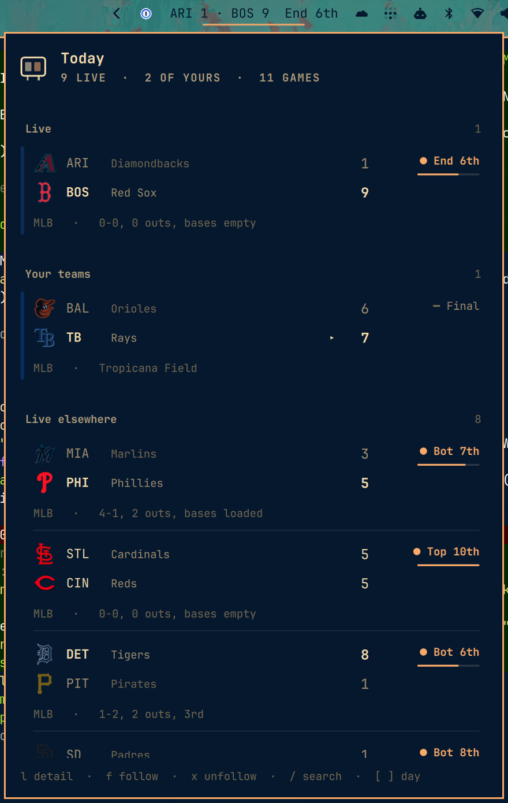

# Scores widget for Omarchy

Live sports scores in the Omarchy bar. One line while a game you follow is on,
a countdown to the next one when it is not, and a keyboard-driven panel behind
it with today's card, league scoreboards, standings and per-game detail.

Built for Omarchy 4 (`shell/plugins`, `manifest.json`, `~/.config/omarchy/plugins/`).



## Install

```bash
omarchy plugin add https://github.com/meirdick/omarchy-scores.git
omarchy plugin enable meirdick.scores
omarchy bar move meirdick.scores --section right   # optional, to place it
```

Plugins land disabled so you can read the code first. Removal is
`omarchy plugin remove meirdick.scores` — the plugin is a plain git checkout
and installs nothing outside its own directory: no hooks, no sudo, no files
elsewhere on the system. It writes exactly two things: its own entry in
`~/.config/omarchy/shell.json` when you follow a team, and HTTP ETags under
`~/.cache/omarchy/meirdick.scores/`.

## Requirements

`curl`. Nothing else, and no API key — see [Where the data comes
from](#where-the-data-comes-from).

## Follow teams and leagues

Nothing is followed on a fresh install, so the widget starts as a dim mark and
the panel leads with **Add a team** and **Add a league**. Both are listed
actions, not just keybinds.

You can follow at two levels, and they are separate lists:

- **A team** — `mlb:BOS`. Its games are yours wherever they appear.
- **A league** — `eng.1`. Every game in the competition is yours.

```bash
# In the panel
#   /  search every team in every league, then f to follow
#   L  the league list, then f to follow the whole competition
#   f  follow whatever is under the cursor
#   x  unfollow it

# From the shell
omarchy-shell meirdick.scores follow mlb BOS
omarchy-shell meirdick.scores unfollow mlb BOS
omarchy-shell meirdick.scores followLeague eng.1
omarchy-shell meirdick.scores unfollowLeague eng.1
omarchy-shell meirdick.scores following        # what is followed, as JSON

# By hand
omarchy bar set meirdick.scores followedTeams "mlb:BOS, nfl:NYJ, eng.1:ARS"
omarchy bar set meirdick.scores followedLeagues "nfl, eng.1"
```

**`f` only ever adds and `x` only ever removes.** There is deliberately no
single key that does both: a toggle removes a team the moment you press it
twice or once by accident, and nothing on screen tells you a follow just
disappeared. Pressing `f` on something you already follow says so and changes
nothing.

Following a league does not drown out your own clubs. If a club you follow is
playing, the bar shows that game; the league's other games fill the bar only
when none of your clubs are on. In the panel they all count as yours.

Only leagues you follow, or that contain a team you follow, are polled. Opening
a league you do not follow fetches it for as long as you are looking at it.

There is one source of truth — the widget's entry in `shell.json` — so a
keypress in the panel and a hand edit cannot disagree.

## What the bar shows

| State | Bar |
|---|---|
| A followed game is live | `BAL 6 · TB 7  Bot 8th` |
| Several are live | the same, rotating, with `1/3` — scroll the widget to step through |
| Somebody scored | the line flashes |
| Nothing live | `NYJ @ BUF · 2h 14m`, counting down to the next one |
| Nothing today | a dim scoreboard mark |
| The fetch is failing | the mark, in the urgent colour |

Click opens the panel, right-click forces a refresh, middle-click opens the
current game on the web, scroll cycles between live games. `barFormat` narrows
it to `compact` or `icon` for a busy bar.

**The bar always shows today**, whatever day the panel is browsing. The widget
is sized to its own text, so letting it follow the panel's date meant paging to
tomorrow resized it and shoved every other widget in the bar sideways. Today's
games are fetched and diffed on their own schedule; the browsed day is a
separate set that only the panel reads.

## The panel

Opens on today: your live games first, then the rest of yours, then everything
else that is live, then the remainder of the card.

Each game is two lines, one per team, with the club's own badge. The team that
is ahead is bold and bright and the one behind recedes, so who is winning is
readable without reading the numbers. A finished game marks the winner with a
caret rather than a colour, so the result survives a monochrome theme.

State is signalled the same way everywhere: a **breathing dot** for live, a
**hollow ring** for a game that has not started, a **flat bar** for one that is
over, and a **pulsing ring in the urgent colour** for a delay. Live games also
carry a progress bar for how far through the game is, and the row sweeps
briefly when a play happens and washes when somebody scores — so movement in
the corner of your eye means something actually happened.

### Keys

| Key | Does |
|---|---|
| `j` `k` | move |
| `l` `enter` | open the game, the league, the standings |
| `h` `esc` | back, then close |
| `f` | follow the team or league under the cursor |
| `x` | unfollow it |
| `o` | open the game on the web |
| `/` | search every team in every league |
| `[` `]` | previous or next day |
| `t` | back to today |
| `L` | the league list, where `f` follows a whole competition |
| `r` | refresh now |
| `g` `G` | top, bottom |
| `tab` | switch to the next bar panel |

Game detail adds the line score by period, every scoring play, and the leaders
where the sport publishes them.

## Notifications

All off. Turn on only what you want:

```bash
omarchy bar set meirdick.scores notifyFinal true --json     # quietest useful setting
omarchy bar set meirdick.scores notifyScore true --json     # every score, both teams
omarchy bar set meirdick.scores notifyStart true --json
omarchy bar set meirdick.scores notifyClose true --json     # close game, late
```

Alerts are derived by diffing polls, not from anything a provider pushes, so
they behave the same whichever provider served the data. The first poll after a
shell restart is suppressed: otherwise every game already in progress would
announce itself the moment you log in. A close game notifies once, not on every
poll it stays close.

`notifyScore` is the loud one. A high-scoring basketball game will notify
dozens of times.

## Polling

The refresh rate follows what is actually happening:

| Condition | Interval |
|---|---|
| A followed game is live | `livePollSec`, 25s by default |
| The panel is open | the same, regardless |
| A followed game starts within the hour | 5 minutes |
| Followed games later today | 15 minutes |
| Nobody you follow plays today | an hour |

Requests are conditional (`ETag`), gzipped, and capped at four concurrent, so a
day with nothing on costs almost nothing. A hung request is cleared by a
watchdog after 45 seconds rather than wedging its slot.

## Leagues

NFL, NCAA football, NBA, WNBA, NCAA basketball, MLB, NHL, the top five European
soccer leagues, Champions League, Europa League, MLS, both World Cups, UFC, F1,
PGA and ATP/WTA are named and browsable.

Anything else ESPN carries works too, without waiting for a release: a
`sport/league` path is passed through verbatim, and a bare `ned.1`-shaped slug
is assumed to be soccer, which is the only family using that form. ESPN
publishes over 200 soccer competitions alone.

```bash
omarchy bar set meirdick.scores followedLeagues "mlb, eng.1, ned.1, rugby/270557"
```

## Where the data comes from

**ESPN's public JSON endpoints, by default.** No key, no signup, no account.
They are what espn.com's own front end calls. They are also **not a documented
or supported API**, and can change without notice. That is the trade: it is the
only free source that covers every league above *and* serves in-progress
scores. Every commercial free tier either excludes live scores outright
(TheSportsDB, football-data.org) or caps you low enough that live polling is
arithmetically impossible — API-Football's free tier is 100 requests per *day*,
which is one poll every 14 minutes across all leagues combined.

Two fallbacks are implemented, both first-party and both keyless:

- **`statsapi.mlb.com`** for MLB. MLBAM's terms explicitly permit "individual,
  non-commercial, non-bulk use", which is exactly this — the clearest legal
  footing of any source here.
- **`api-web.nhle.com`** for NHL.

They exist so a break in one source is a config change rather than a rewrite:

```bash
omarchy bar set meirdick.scores providerChain '{"mlb":["mlb","espn"],"nhl":["nhl","espn"]}' --json
```

If a league's first provider fails, the next one is tried before anything is
reported as an error.

### A warning for contributors

`site.api.espn.com` returns **403 to browser-shaped User-Agents** and 200 to
curl's own. Verified:

| User-Agent | Response |
|---|---|
| `curl/8.16.0` | 200 |
| `python-requests/2.32` | 200 |
| `Go-http-client/2.0` | 200 |
| `Mozilla/5.0 (X11; Linux x86_64) … Chrome/140` | **403** |
| `Wget/1.21` | **403** |
| *(empty)* | **403** |

This is backwards from the usual scraping instinct, and "helpfully" setting a
browser User-Agent is the single most likely way to break this plugin. The
default host, `site.web.api.espn.com`, has no such gate — but the fetcher still
sets no User-Agent at all, deliberately. Leave it alone.

Requests always send `--compressed`: it takes the MLB scoreboard from 214 KB to
20 KB, which is what makes a 25-second poll reasonable.

## Settings

Set with `omarchy bar set meirdick.scores <key> <value>`, or by hand in the
widget's entry in `~/.config/omarchy/shell.json`. Omarchy parses the manifest's
`schema` into its widget registry but ships no settings UI that renders it yet,
so those two are the way in for now. Booleans and JSON need `--json`; plain
strings must not have it.

| Key | Default | What |
|---|---|---|
| `followedTeams` | `""` | comma-separated `league:ABBR` |
| `followedLeagues` | `""` | comma-separated league slugs |
| `livePollSec` | `25` | refresh while a followed game is live |
| `idlePollSec` | `900` | floor when nothing you follow is on |
| `barFormat` | `full` | `full`, `compact`, `icon` |
| `rotateSec` | `6` | seconds each live game holds the bar |
| `showSituation` | `true` | count/outs/runners, down and distance |
| `showAllGames` | `true` | the "Also today" section |
| `finalWindowHours` | `8` | how long a final keeps the bar slot |
| `notifyStart` | `false` | |
| `notifyScore` | `false` | |
| `notifyFinal` | `false` | |
| `notifyClose` | `false` | |
| `closeMargin` | `1` | score gap that counts as close; ~6 for football |
| `closeClockSec` | `300` | clock below which a close game qualifies |
| `providerChain` | `""` | JSON, per league |
| `espnHost` | `""` | host override; see the warning above |

## IPC

```bash
omarchy-shell meirdick.scores toggle
omarchy-shell meirdick.scores refresh
omarchy-shell meirdick.scores follow mlb BOS
omarchy-shell meirdick.scores followLeague eng.1
omarchy-shell meirdick.scores following               # teams and leagues, as JSON
omarchy-shell meirdick.scores route standings:nfl    # "", leagues, league:mlb, standings:nfl, search
omarchy-shell meirdick.scores diagnose               # JSON: what the widget believes
```

`route` is bindable, so `standings:nfl` or `league:eng.1` can have its own
hotkey. `diagnose` is the debug hatch: QML load failures and bad settings are
both silent on screen, and this is the only practical way to see what the
widget thinks is true.

## Development

```
Widget.qml       the bar slot: score line, rotation, flash, click routing
Panel.qml        the panel: routes, cursor, delegates, IPC
Service.qml      polling, the fetch pool, diffing, notifications
Providers.js     ESPN / MLB / NHL adapters -> one normalized Game
Model.js         formatting, sorting, row building, the diff
Leagues.js       canonical slug <-> each provider's own
Indicators.qml   live / upcoming / final / delayed marks
TeamCrest.qml    club badge, with a monogram when there is no logo
ScoresMark.qml   the plugin's own mark
```

The three `.js` files are pure functions with a `module.exports` tail, so they
run under plain `node` with no compositor:

```bash
node test/providers.test.js    # parsing, across five leagues and both summary shapes
node test/fallbacks.test.js    # MLB and NHL fallbacks, cross-checked against ESPN
node test/model.test.js        # formatting, diffing, pacing, row building
```

`fixtures/` holds real captured responses covering scheduled, live, delayed and
final games. The cross-provider test parses the same MLB slate through two
independent providers and asserts they agree — an abstraction with one
implementation is not an abstraction.

Three things that will cost you an hour if nobody tells you:

- **Editing a `.js` file does not hot-reload.** Saving under
  `~/.config/omarchy/plugins/` reloads `.qml`, because `Qt.clearComponentCache()`
  clears QML components and nothing else. Run `omarchy-restart-shell` after
  touching `Providers.js`, `Model.js` or `Leagues.js`. In practice a restart is
  also the only reliable way to pick up a changed inline component type.
- **QML load failures are silent.** The widget simply does not appear. Read the
  reason with `quickshell log -i "$(quickshell list --all | grep -oP 'Instance \K\w+' | head -1)" -t 100`.
- **`qmllint` on Arch is a stub** that exits 0 on a deliberate syntax error.
  Loading the plugin is the only real test.
- **The injected `settings` object does not reliably follow `shell.json`.**
  Writing a new `followedTeams` and reading it back returned the old value for
  as long as the shell stayed up; `omarchy-shell shell reloadConfig` did not
  shake it loose, only a full restart did. Since following a team writes to
  that file, the plugin watches `shell.json` itself with a `FileView` and
  prefers what the file says. When the injection works, both agree and the
  watcher changes nothing.

Nerd Font codepoints are checked against the shipped font's charset before use.
The marks here are drawn from primitives instead, because the shell's font
family is the fontconfig alias `monospace`, which Qt does not reliably resolve
to the concrete Nerd Font — a private-use codepoint then renders as whatever
fallback owns it. This plugin shipped an integral sign as its icon exactly once.

## Marketplace

Listed via [omarchyplugins.com](https://omarchyplugins.com). Conformance:

- public repo with `manifest.json` at the root
- all eight required manifest fields: `schemaVersion`, `id`, `name`, `version`,
  `author`, `description`, `kinds`, `entryPoints`
- `README.md` and `LICENSE` present
- safe install and removal — a git checkout with no install hooks
- `preview.png` for the listing card
- passes `omarchy plugin validate`

Category: **Widgets**. Tags: **Bar**, **Quickshell**.

Scores, team names, badges and league marks come from ESPN and the leagues'
own endpoints and belong to their respective owners. This plugin is not
affiliated with ESPN, MLB, the NHL, or any league or club.
